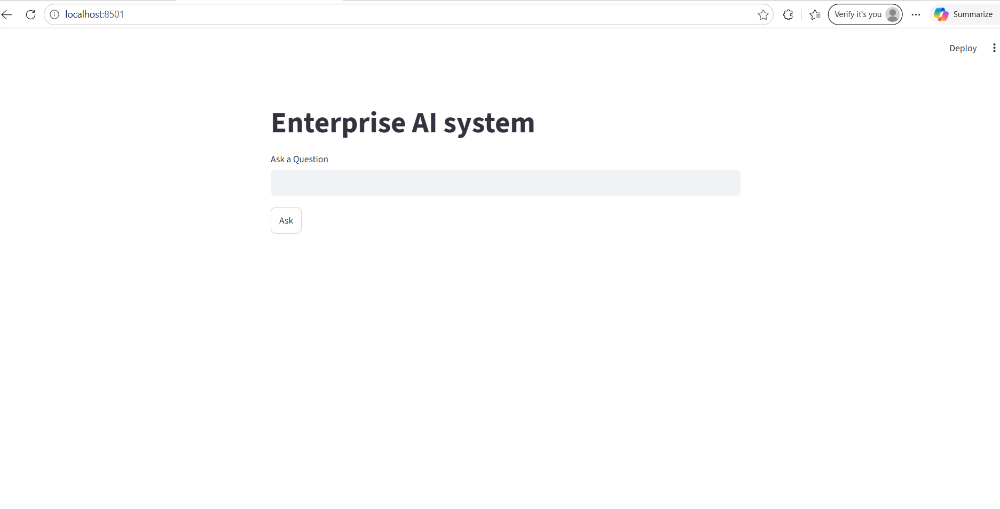
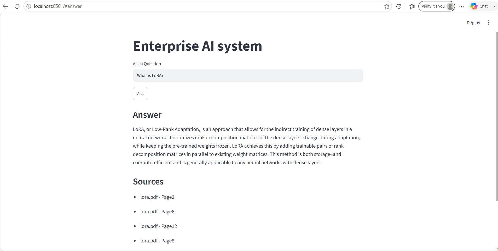
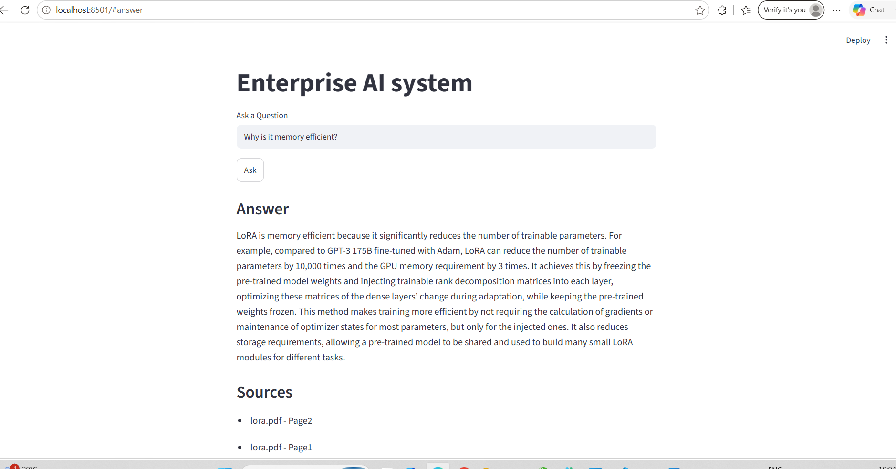
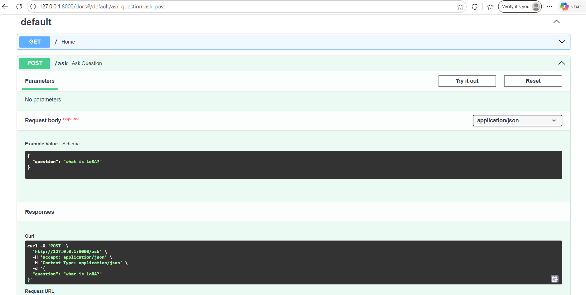
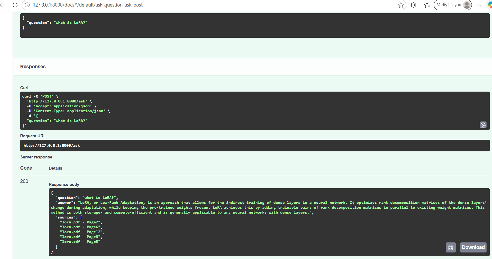

# Enterprise AI Document Intelligence System

An end-to-end Retrieval-Augumented Generation (RAG) system that enables users to interact with enterprise documents through natural language queries. The system combines Hybrid Retrieval(Semantic Search + BM25), Query Rewriting, Cross-Encoder Reranking, Conversation Memory, and Large Language Models (LLMs) to generate accurate, context-grounded answers with source citations.


-----

## Project Overview

Enterprise organizations store large volumes of information across documents such as HR policies, employee handbooks, technical manuals, research papers, compliance documents, and internal knowlege bases. Finding accurate information manually is time-consuming, and relying solely on Large Language Models can lead to hallucinations because they lack access to organization-specific knowledge.

This project addresses that problem by building a Retrieval-Augumented Generation (RAG) system that retrieves relevant document chunks before generating a response. Instead of relying only on the LLM's internal knowledge, every answer is grounded in retrieved context and accompaied by source citations, improving transparency and reducing hallucinations.


-----

## Problem Statement

Traditional keyword-based document search has several limitations:

- Traditional keyword search cannot understand semantic meaning.
- Users must manually search across multiple documents.
- Follow-up questions lose conversational context.
- Standalone LLMs hallucinate when organization-specific knowlege is unavailable.
- Locating relevant enterprise information becomes increasingly difficult as document collections grow.


The objective of this project is to design a modular AI-powered document intelligent system that enables users to ask questions in natural language and receive accurate, context-grounded answers with references to the original documents.

-----

## Solution Overview

The system follows a modular Retrieval-Augumented Generation (RAG) architecture.

1. Enterprise documents are ingested and preprocessed.
2. Documents are split into context-preserving chunks.
3. Dense embeddings are generated and indexed in ChromaDB.
4. BM25 indexes are built for keyword retrieval.
5. User queries are rewritten using conversation history when necessary.
6. Hybrid Retrieval combines semantic search and BM25.
7. Cross-Encoder reranking improves retrieval relevance.
8. The highest ranked context is provided to Gemini.
9. Responses are generated together with source citations.


## Architecture


                  Enterprise Documents (PDFs)
                           │
                           ▼
                  PyMuPDF Document Loader
                           │
                           ▼
          Structure-Aware Text Extraction
                           │
                           ▼
        Recursive Text Chunking (500-700)
                           │
                           ▼
     BAAI/bge-base-en-v1.5 Embeddings
                           │
                           ▼
     ChromaDB + BM25 Index Creation
──────────────────────────────────────────────────

User Question (Streamlit/FastAPI)
                │
                ▼
      Conversation Memory
                │
                ▼
     Query Rewriting (Groq LLM)
                │
                ▼
       Hybrid Retrieval
    (Vector + BM25 Search)
                │
                ▼
          Reranker
                │
                ▼
      Top-K Relevant Chunks
                │
                ▼
      Gemini LLM Generation
                │
                ▼
 Answer + Source Citations
                │
                ▼
  Streamlit / FastAPI Response

──────────────────────────────────────────────────

Evaluation Pipeline

Retrieval
• Recall@K
• MAP
• NDCG

Generation
• Faithfulness
• Answer Relevancy
• Correctness
• Completeness
(LLM-as-a-Judge)


## Key Features

- Enterprise Document Question Answering using Retrieval-Augmented Generation (RAG)
- Hybrid Retrieval combining Dense Retrieval and BM25 keyword search Retrieval
- Query Rewriting using Groq LLM to improve retrieval for  conversational and ambiguous queries
- Cross-Encoder Reranking for improved retrieval relevance
- Conversation Memory for  context-aware multi-turn interactions
- Context-Grounded Response Generation using Google Gemini
- Automatic Source Citation with document and page-level references
- Retrieval Evaluation Pipeline using Hit@k, Recall@k, Precision@k, MAP, MRR, and nDCG
- Generation Evaluation Pipeline using RAGAS metrics including Faithfulness, Answer Relevancy, Completeness, Correctness
- LLM-as-a-judge evaluation framework for qualitative assesment of generated responses 
- FastAPI REST API backend
- Interactive Streamlit Web Interface
- Modular pipeline architecture designed for  experimentation and future extension 


## Tech Stack

| Category | Technologies |
|----------|--------------|
| Programming Language | Python |
| Backend Framework | FastAPI |
| Frontend | Streamlit |
| LLM | Google Gemini 2.5 Flash|
| Query Rewriter LLM | Groq (Llama 3)
| Embedding Model | BAAI/bge-base-en-v1.5 |
| Vector Database | ChromaDB |
| Keyword Retrieval | BM25 |
| Reranking | Cross-Encoder (Sentence Transformers) |
| PDF Processing | PyMuPDF |
| API Testing | FastAPI Swagger UI |
| Environment Management | Conda |
| Configuration | python-dotenv |
| Evaluation | Hit@K, Recall@K, Precision@K, MRR, MAP, nDCG,RAGAS(Faithfulness, Answer Relevancy, Correctness, Completeness),LLM-as-a-judge |
|Version Control | Git & GitHub |


## Project Structure

```text
enterprise_ai_system/
│
├── api/                 # FastAPI backend and API endpoints
├── frontend/            # Streamlit user interface
├── ingestion/           # Document loading and preprocessing
├── retrieval/           # Hybrid retrieval pipeline
├── generation/          # LLM answer generation
├── vectorstore/         # ChromaDB vector database operations
├── memory/              # Conversation memory management
├── agents/              # Query rewriting and agent modules
├── evaluation/          # Retrieval and generation evaluation
├── tests/               # Testing utilities
├── data/                # Input documents
├── chroma_db/           # Persistent vector database
│
├── rag_pipeline.py      # End-to-end RAG orchestration
├── requirements.txt
├── .env.example
├── README.md
└── .gitignore
```


## Core Pipeline

1. Document Ingestion
2. Text Chunking
3. Embedding Generation
4. ChromaDB Indexing
5. BM25 Indexing
6. Query Rewriting
7. Hybrid Retrieval
8. Cross-Encoder Reranking
9. Context Construction
10. Gemini Response Generation
11. Source Citation Generation
12. Response Delivery through FastAPI and Streamlit


## Installation

### 1. Clone the Repository

```bash
git clone https://github.com/ramamoorthi-m/enterprise_ai_system.git
cd enterprise_ai_system
```

### 2. Create and Activate Conda Environment

```bash
conda create -n enterprise-ai python=3.11
conda activate enterprise-ai
```

### 3. Install Dependencies

```bash
pip install -r requirements.txt
```

### 4. Configure Environment Variables

Create a `.env` file in the project root.

```text
GEMINI_API_KEY=your_gemini_api_key
GROQ_API_KEY=your_groq_api_key
```

### 5. Add Enterprise Documents

Place your PDF documents inside the `data/` directory.

### 6. Build the Knowledge Base

```bash
python rag_pipeline.py
```

### 7. Start the FastAPI Backend

```bash
uvicorn api.main:app --reload
```

### 8. Launch the Streamlit Interface

```bash
streamlit run frontend/app.py
```

The application is now ready for document question answering.


## Usage

1. Launch the FastAPI backend.
2. Start the Streamlit application.
3. Enter a natural language question.
4. The system automatically:

   - Rewrites the query (when required)
   - Retrieves relevant document chunks using Hybrid Retrieval
   - Reranks retrieved results
   - Generates a context-grounded answer using Gemini
   - Returns document source citations

Example questions:

- What is LoRA?
- Why is LoRA memory efficient?
- Explain rank decomposition.
- Compare LoRA with full fine-tuning.


## Evaluation

The project includes independent evaluation pipelines for both retrieval quality and generation quality.

### Retrieval Evaluation

The retriever is evaluated using standard Information Retrieval metrics:

- Hit@K
- Recall@K
- Precision@K
- Mean Average Precision (MAP)
- Mean Reciprocal Rank (MRR)
- Normalized Discounted Cumulative Gain (NDCG)

These metrics measure how effectively the system retrieves relevant document chunks before answer generation.

### Generation Evaluation

Generated responses are evaluated using RAGAS together with an LLM-as-a-Judge framework.

Metrics include:

- Faithfulness
- Answer Relevancy
- Correctness
- Completeness

This two-stage evaluation strategy enables systematic assessment of both retrieval effectiveness and answer quality.


## Future Improvements

The current system serves as a strong foundation for an enterprise document intelligence platform. Planned enhancements include:

- Document upload directly from the web interface
- Support for Word, Excel, PowerPoint, HTML, Images and Scanned PDFs
- OCR pipeline for scanned documents
- Structure-aware extraction for tables, forms and layouts
- Metadata-aware retrieval
- Parent-Child and Hierarchical Chunking
- Advanced embedding models and domain-specific embeddings
- Hybrid search optimization
- Agentic RAG workflow using AI Agents
- Multi-document summarization
- Role-based document access
- Feedback-driven retrieval optimization
- Cloud deployment with Docker and Kubernetes
- Monitoring, logging and observability

## Limitations

Current limitations of the project include:

- Supports PDF documents only.
- Documents are indexed before runtime; live document upload is not yet supported.
- Optimized primarily for English-language documents.
- Evaluation dataset is currently limited in size.
- Designed for local deployment; cloud deployment is planned.
- Retrieval quality depends on document quality, chunking strategy and embedding performance.


## Demo Screenshots

### Streamlit Home Page



The Streamlit interface provides a simple web application for interacting with the Enterprise AI Document Intelligence System.

---

### Question Answering



A user submits a natural language question. The system retrieves relevant document chunks using Hybrid Retrieval, reranks the results, and generates a grounded answer with source citations.

---

### Conversation Memory



The system preserves conversation history and uses it for query rewriting, enabling context-aware follow-up questions.

---

### FastAPI Documentation


Interactive Swagger UI automatically generated by FastAPI for testing and validating REST API endpoints.

---

### API Request Example



Example request payload demonstrating how client applications interact with the `/ask` endpoint.

---

### API Response



Successful API response containing the generated answer together with the retrieved source citations.


## Future Roadmap

### Phase 1 (Completed)

- Document ingestion
- PDF extraction
- Chunking
- Embedding generation
- ChromaDB indexing
- Hybrid Retrieval
- Query Rewriting
- Cross-Encoder Reranking
- Conversation Memory
- Gemini Answer Generation
- Source Citations
- FastAPI Backend
- Streamlit Frontend
- Retrieval Evaluation
- Generation Evaluation

### Phase 2

- Docker containerization
- Cloud deployment
- CI/CD pipeline
- Monitoring and logging
- Performance optimization

### Phase 3

- Enterprise document support
- OCR for scanned documents
- Structure-aware extraction
- Advanced chunking strategies
- Improved embedding models

### Phase 4

- Agentic RAG
- Multi-agent workflows
- Tool-calling agents
- Knowledge Graph integration
- Production-scale enterprise deployment


## Lessons Learned

Throughout this project, I gained hands-on experience with:

- Retrieval-Augmented Generation (RAG)
- Hybrid Retrieval Systems
- Information Retrieval Evaluation
- LLM Evaluation using RAGAS and LLM-as-a-Judge
- FastAPI API development
- Streamlit application development
- Vector Databases
- Prompt Engineering
- Modular AI system design

## Engineering Highlights

- Designed a modular RAG architecture with independent ingestion, retrieval, generation, evaluation, and API layers.
- Implemented Hybrid Retrieval by combining semantic vector search with BM25 keyword retrieval.
- Improved retrieval quality using Cross-Encoder reranking.
- Enhanced conversational retrieval through LLM-based query rewriting.
- Added conversation memory to support context-aware multi-turn interactions.
- Built separate evaluation pipelines for retrieval and generation instead of relying solely on manual testing.
- Used LLM-as-a-Judge alongside RAGAS metrics to systematically evaluate response quality.
- Exposed the system through FastAPI and developed an interactive Streamlit interface.